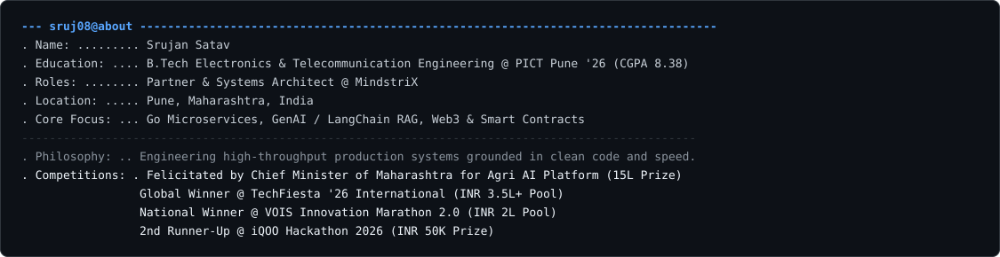
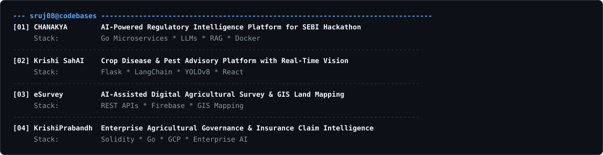
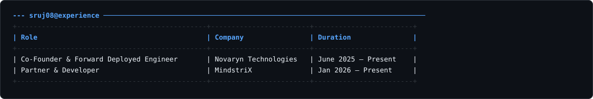

<picture>
  <source media="(prefers-color-scheme: dark)" srcset="dark_mode.svg" />
  <source media="(prefers-color-scheme: light)" srcset="light_mode.svg" />
  
</picture>

  

  

  

  

  

  

  

---

  sruj08 @ terminal profile • © Srujan Satav

