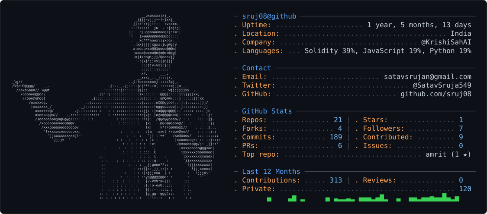
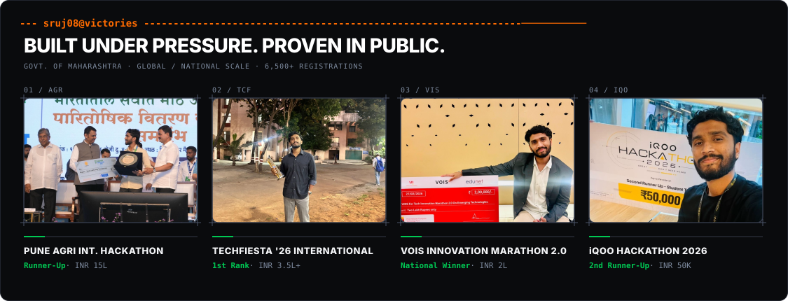
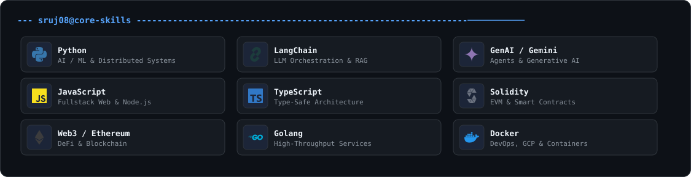
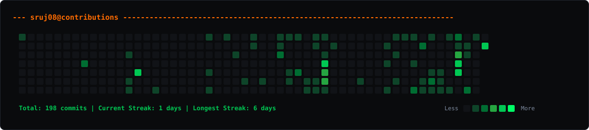

<!-- HEADER BANNER -->

  

<h1 align="center">Srujan Satav</h1>

  <strong>Forward Deployed Systems Builder & AI Engineer</strong> 
  <em>Deploying resilient systems, intelligence engines, and autonomous agents to solve critical infrastructure challenges.</em>

<!-- SOCIAL LINKS (FRICTIONLESS CONTACT) -->

   &nbsp;&nbsp;·&nbsp;&nbsp;
   &nbsp;&nbsp;·&nbsp;&nbsp;
   &nbsp;&nbsp;·&nbsp;&nbsp;
  

---

### ENGINEERING MANIFESTO

> *"I build resilient, zero-to-one systems for complex domains. From satellite data analysis to cryptographically-secured regulatory cores, I ship production-ready architecture under extreme constraints."*

*   **Zero-to-One Architecture**: Translating ambiguous domain requirements into deployable software across agriculture, fintech, cybersecurity, and governance.
*   **Production Deployment**: Driving architecture decisions across AI, blockchain, and satellite-data platforms, balancing scalability with delivery speed.
*   **Proven Execution**: Led engineering teams to top ranks across 2,000+ competitor national and international hackathons.

---

### FEATURED PROJECTS (EVIDENCE OF EXECUTION)

#### **01. KRISHI SAHAI** | *Predictive Agricultural Intelligence Platform*
> Predictive agricultural platform combining disease forecasting, edge-cached voice interaction, and resource routing.

*   **Engineering Feat**: Implemented Opus codec for offline edge compression, optimizing 2G payloads by 78%, alongside a deterministic risk engine for 3-5 day disease forecasting.
*   **Stack**: `PyTorch` · `YOLOv8` · `LangChain` · `Flask` · `React`
*    [sruj08/KrishiSahAI](https://github.com/sruj08/KrishiSahAI)
 

#### **02. CHANAKYA** | *Sovereign Regulatory Operating System (RegOS)*
> Regulatory Operating System (RegOS) built for SEBI to automate macroeconomic policy compliance using Open Policy Agent.

*   **Engineering Feat**: Engineered a bi-temporal SQLite engine with application-level Ed25519 signed obligations and recursive graph queries to ensure tamper-proof, "as-of" regulatory auditing.
*   **Stack**: `Go` · `SQLite` · `OPA/Rego` · `Claude-3.5-Sonnet` · `Next.js 16`
*    [mridulbansal4/Chanakya](https://github.com/mridulbansal4/Chanakya)
 

#### **03. AMRIT** | *Advanced Mission Resource Intelligence Tool (ISRO)*
> Lunar mission-intelligence platform converting raw Chandrayaan-2 DFSAR polarimetry into actionable water-ice probability maps and power-aware rover traverses.

*   **Engineering Feat**: Built a physics-informed electromagnetic scattering model collapsing radar false-positives from 34.2% to 1.9%, paired with a 50,000-sample Monte Carlo resource inversion engine.
*   **Stack**: `Python` · `NumPy/SciPy` · `React 18` · `TypeScript`
*    [sruj08/amrit](https://github.com/sruj08/amrit)

---

### HACKATHON VICTORIES (PROOF OF VELOCITY)

  

  <strong>AgriTech</strong> / Deep-Tech Solutions &nbsp;|&nbsp; 
  <strong>FinTech</strong> / Disruptive Startups &nbsp;|&nbsp; 
  <strong>Web3</strong> / Decentralized Infrastructure

---

### TECH STACK

  

---

### ACTIVE EXECUTION (CONTRIBUTION CALENDAR)

  

