<div align="center">

### <code>sruj08@github ~ $ ./contributions.sh</code>

<a href="https://github.com/sruj08">
  
</a>

<br><br>

### <code>sruj08@github ~ $ whoami</code>

<table border="0" cellpadding="0" cellspacing="0">
  <tr>
    <td valign="top" align="center">
      
    </td>
    <td valign="top" align="center">
      
    </td>
  </tr>
</table>

<br>

```sys
System Status: 🟢 All services operational | Location: Pune, India | Stack: Python / C++ / ENTC
```

---

<p align="center">
  <a href="https://github.com/sruj08">GitHub</a> •
  <a href="https://x.com/SatavSruja549">X (Twitter)</a>
</p>

</div>
